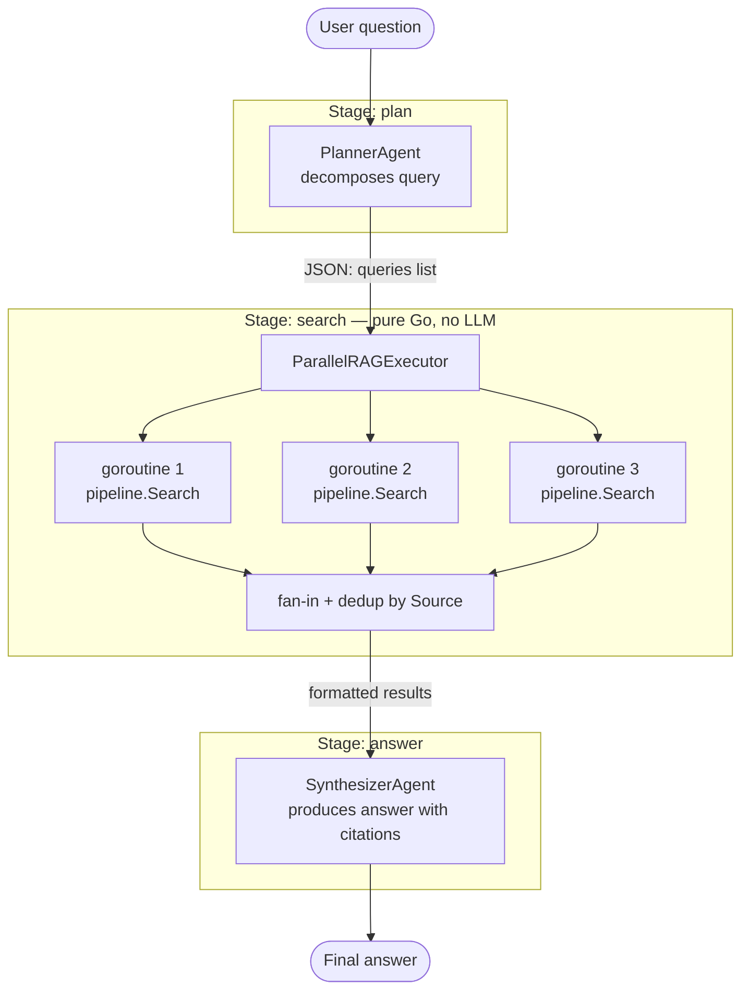

# multi-agent-rag

Demonstrates **Agentic RAG Pattern 3** — multi-agent query decomposition with
parallel retrieval and synthesis.

## Flow



## Pattern explained

| Stage | Executor type | Responsibility |
|-------|--------------|----------------|
| `plan` | `AgentStage` (LLM) | Decompose the user query into ≤ N focused sub-queries; output JSON |
| `search` | `ParallelRAGExecutor` (pure Go) | Fan-out one goroutine per sub-query; fan-in and deduplicate by source |
| `answer` | `AgentStage` (LLM) | Synthesize a single answer with inline `[source: filename]` citations |

### When to use this pattern vs basic RAG

| Situation | Recommendation |
|-----------|---------------|
| Simple, focused question | Basic RAG (Pattern 1 or 2) — one query is enough |
| Multi-faceted question covering several topics | Pattern 3 — decompose to improve recall |
| Question comparing or relating multiple concepts | Pattern 3 — parallel search maximises coverage |
| Latency-sensitive path, single-query sufficient | Pattern 2 — skip the extra LLM round-trip |

### Key design decisions

**`ParallelRAGExecutor` as a struct** — makes it testable in isolation. Build a
`StageContext` with a hardcoded `"plan"` output and verify fan-out without running
the full pipeline or calling any LLM.

**Output key `"search"` as the inter-stage contract** — if the key is changed on
one side, `RequireOutput` returns a descriptive error at runtime rather than
silently passing empty data.

**Deduplication by `Source`** — keeps the first (highest-scored) occurrence of each
document. Prevents the Synthesizer from over-weighting a source that appears in
multiple query results.

**Strategy A for JSON parsing** — the system prompt forbids extra text. If the model
adds prose, `json.Unmarshal` fails with a clear error. Add an `extractJSON()` helper
in `parallel.go` as an escape hatch if a specific model does not honour the format.

## Prerequisites

```bash
ollama pull qwen3:latest          # chat model (Planner + Synthesizer)
ollama pull nomic-embed-text      # embedding model (RAG)
```

## Usage

```bash
# Default question
go run ./examples/multi-agent-rag

# Custom question
go run ./examples/multi-agent-rag "What chunking strategies does goagent support?"
```

Example output:

```
Question: How does goagent handle memory, and what is the difference with RAG?

goagent provides two memory mechanisms for different purposes...
[source: memory.md] ShortTermMemory holds the active conversation window...
[source: rag.md] RAG indexes arbitrary documents, not conversation history...

--- Trace ---
  plan:    1.2s
  search:  320ms
  answer:  2.1s
```
